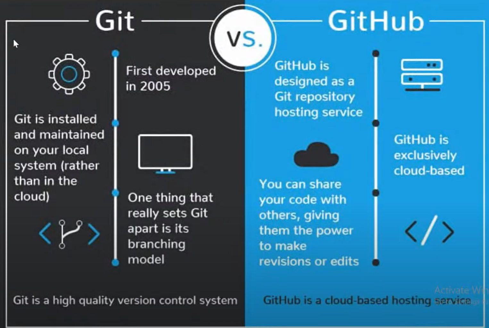

# Understanding Git and GitHub - Monday 6th February

[Link](https://www.youtube.com/watch?v=Lu979oC4ba8) to CFG MOOC Sprint

- [Understanding Git and GitHub - Monday 6th February](#understanding-git-and-github---monday-6th-february)
  - [What is Version Control](#what-is-version-control)
  - [How does Git and GitHub work](#how-does-git-and-github-work)
  - [Setting Up Git and GitHub](#setting-up-git-and-github)

***

## What is Version Control

**Version Control** is a system that will help you keep track of the changes and history of your project throughout its lifestyle.

***

## How does Git and GitHub work

**Git** is a version control system and is open-source and free, it is the most widely used version control system. There are other version control systems that can be used.

**GitHub** is a cloud-based hosting service, platform that helps you perform version control. Where all the projects are hosted, and where you can keep all your content safe.

Combining Git and GitHUb together we have a **Version Controlled Project**

 

    

***

## Setting Up Git and GitHub